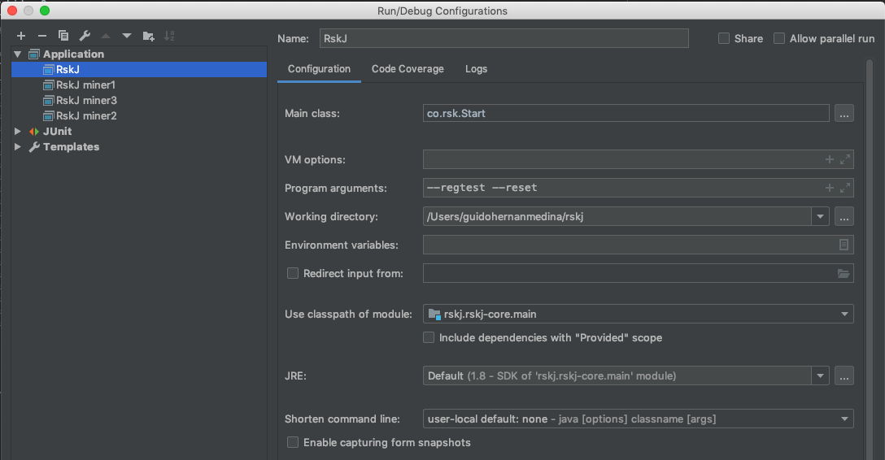
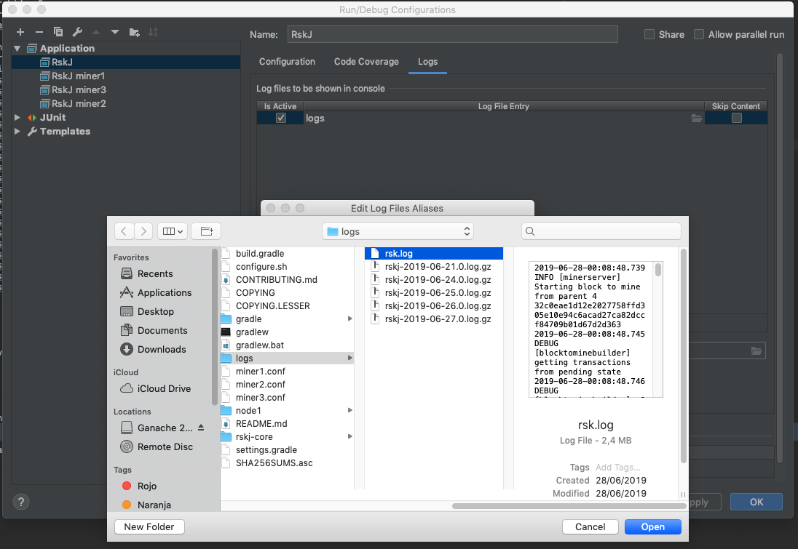
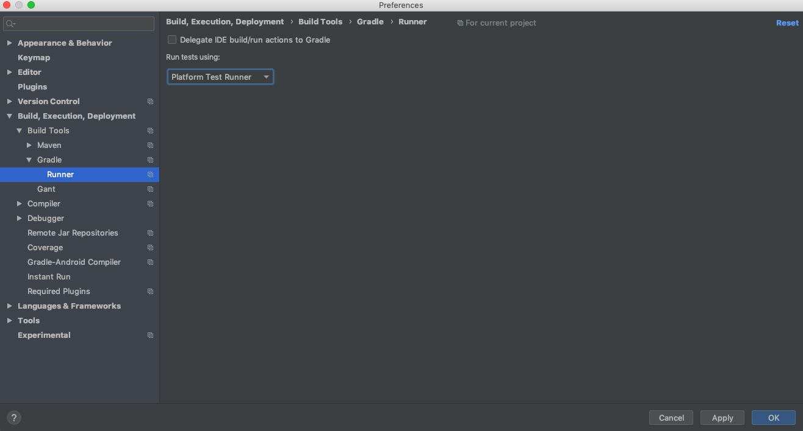

# First Steps RSK
## Documentation 
- [Intro Bitcoin](https://www.youtube.com/watch?v=YBNr69vrscw)
- [Intro Smart Contracts](https://www.youtube.com/watch?v=ZE2HxTmxfrI&pbjreload=10)
- [Curso Bitcoin - Español](https://www.youtube.com/channel/UCtr89rxrUb9YcMSX60cD79g)
- [El valor real de la tecnologia Bitcoin - Español](http://bitcoinproperly.org/es/)
- [Beyond Bitcoin - Diego Gutiérrez Zaldivar](https://media.rsk.co/bitcoin-la-punta-del-iceberg/)
- [Internet of Value & Smart Contracts - Diego Gutiérrez Zaldivar](https://www.youtube.com/watch?v=2WIg3-rr3Hk)
- [Internet of Value - Diego Gutierrez Zaldivar](https://www.youtube.com/watch?v=fyfYoe4LOgc)
- [Getting Started: Basic Questions](https://gitter.im/rsksmart/getting-started?source=orgpage)
- [What's RSK](https://www.youtube.com/watch?v=GfW8ZjQdwmU&feature=youtu.be)
- [RSK Labs at World Blockchain Forum by Diego Gutiérrez Zaldivar](https://www.youtube.com/watch?v=WhDJAi4vddQ)
- [Q&A with Sergio Lerner Chief Scientist in RSK](https://www.youtube.com/watch?v=EOVJevr0muM)
- [IOV Labs Vision](https://youtu.be/dBoa6bJ5sIk)
- [RSK Wiki](https://github.com/rsksmart/rskj/wiki)
- [Programa para ejecutivos](https://drive.google.com/open?id=1nATjtMEEINSbYEaAceNEXno-2nLr2MG0)
- [Mastering Bitcoin](https://www.bibliadelprogramador.com/2018/06/mastering-bitcoin-en-espanol.html)
- [Mastering Ethereum](https://github.com/ethereumbook/ethereumbook)
- [Intro Solidity](https://solidity-es.readthedocs.io/es/latest/introduction-to-smart-contracts.html)
- [OpenZeppelin](https://openzeppelin.org/)

## Required Software

- [Java JDK 8](https://www.oracle.com/technetwork/pt/java/javase/downloads/jdk8-downloads-2133151.html)
- [IntelliJ Idea](https://www.jetbrains.com/idea/download/download-thanks.html?platform=mac&code=IIC)
- [Visual Studio Code](https://code.visualstudio.com/download) 
  - add Solidity Plug-in (Juan Blanco)
- [Truffle](https://truffleframework.com/truffle)
- [Docker](https://truffleframework.com/truffle)
- [Git](https://git-scm.com/downloads)
- [Ganache](https://www.trufflesuite.com/ganache)

## Node debugger configuration

After downloading the [RSK node](https://github.com/rsksmart/rskj) and opening it on IntelliJ, add debug configuration like:



Add rsk.log file from project directory in order to see full log:



In case node is not logging, it is probable you have to update the Graddle runner preferences. It is needed to uncheck option 'Delegate IDE build/run actions to Gradle' and select 'Platform Test Runner' on combobox:



## How to build jar file

In order to build a jar from any version, once you have the latest version of the tag you want you have to run this command from terminal:

``` ./gradlew build -x test ``` 

##### jar file is created on path /rskj/rskj-core/build/libs

(``` -x test ``` parameter is added to exclude tests, so that building process is faster. You can leave it to run tests)


## Run Dockerized tests

After getting Docker, a good example to get in touch with contracts and tests can be found here:

[wasabi-opcode tests](https://github.com/rsksmart/dockerized-network/tree/wasabi-opcodes/wasabi-opcodes)

There you can see:
  - create2 contract example
  - Difference between using method with .call() and without it. It is important as you learn that using .call() after method causes no impact on blockchain (could consider it as a GET action), but invoking method without it causes impact on the blockchain.
